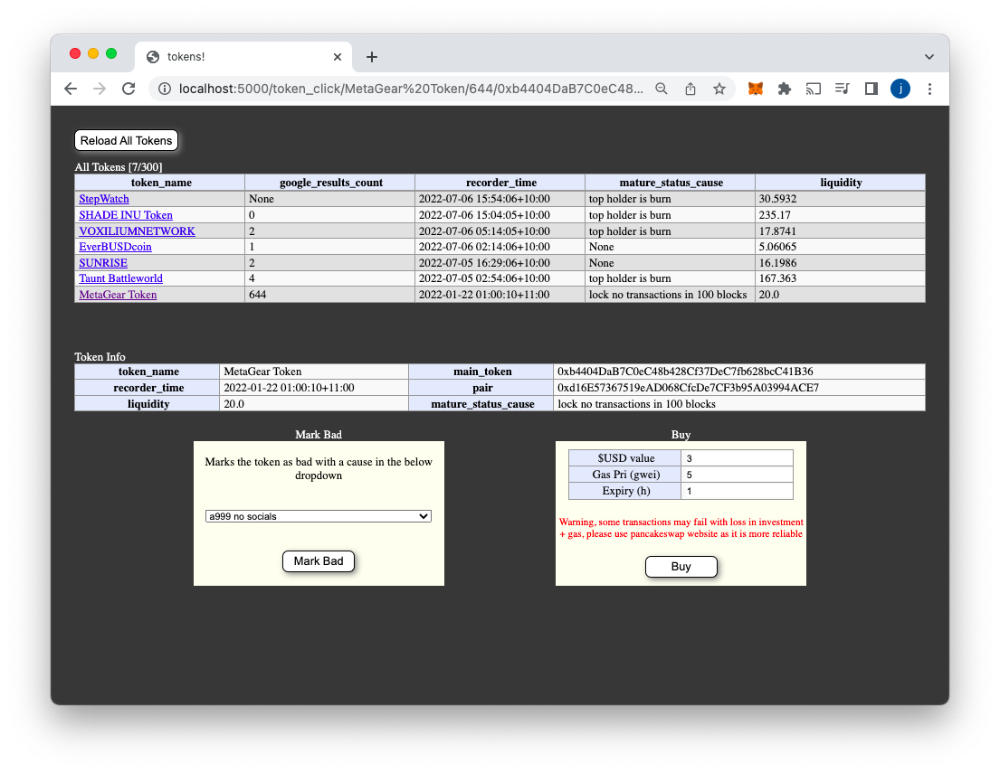
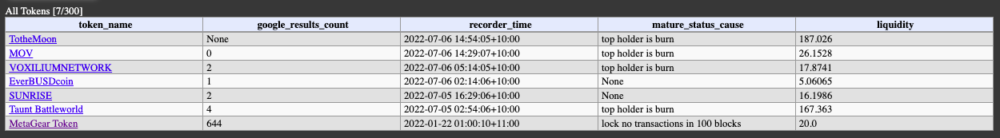
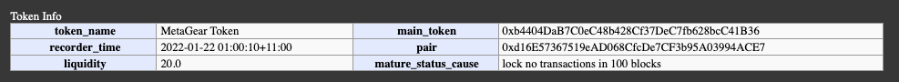
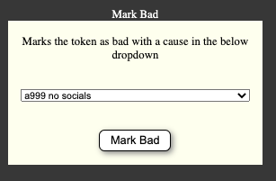
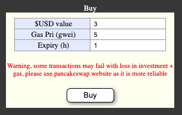
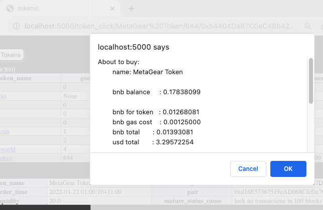

A full stack crypto exchange for sniping the latest quality shit coins on binance smart chain

## DISCLAIMER

```diff
- >99% of pairs on BSC are scams. Using this sniper is high risk
```

```diff
- I would suggest using pancake swap website over the buy feature as it can malfunction. Purchasing is disabled by default in the environment variables
```

## FEATURES

### WEB INTERFACE

Overview


All Tokens table displays the latest quality tokens


Token Info table displays more details on the selected coin


Mark Bad form enables user to manaully remove a coin with a reason



Buy form enables user to quickly purchase the token for a given price



Quote alert shows more details when clicking buy



## TECH

- Languages: python, SQL, javascript, html, css, bash
- Frameworks: flask
- OS: Raspberry Pi Linux server and any client OS
- APIs: web3, bscscan, google custom search api
- SQL tools: mysql-connector, mariadb
- Web scraping tools: selenium, beautifulsoup4, pyvirtualdisplay
- Charting: matplotlib
- Pi monitoring tools: gpiozero
- Storing env variables: dotenv
- 3rd party: Metamask

## Extra Features

#### Python

- State management in flask for dynamic user experience
- Flask redirects
- Flask flash mesages. Used to display messages for action: marking token bad and showing transaction reciept
- REST to GET data and POST data securely
- Buy module to wrap web3 with functions to quote and buy tokens from pancake swap
- SQL modules to wrap connection, select and update methods for rpi and client side

#### Standard Web (html / js / css)

- Html template rendering
- Javascript with alert handling confirmation
- Javascript with XMLHttp post requests to flask routes with callback functions on success
- CSS styling

#### Raspberry Pi

- Bash commands to run cronjobs
- Cronjob to run python code to
  - check new tokens
  - check early status\*
  - check mature status\*\*
  - check drops in liquidity
  - check google search results
  - checks memory in-case of reboot
- \*Early status checks tokenomics for
  - is contract verified
  - is contract not a proxy
  - is contract not a honeypot
  - is ownership renounced in the contract
- \*\*Mature status shecks tokenomics for
  - is liquidity >= 1 wbnb
  - is not a rugpull (top holder's locked liquidity percent >=95)
  - is lock expiry >= 11months from now

#### Code Style

- Docstrings for all fuctions
- Code formatted with python black

#### Other

- Cmd line to backup tokens sql data to client folder
- Cmd line to show plot of all locks found

## INSTALL and RUN

### SETUP PI

1. Load ssd using rpi imager
   using the latest debian light version. I used:
   OS Lite 32bit debian bullseye 2022-04-04

2. Modify the static ip
   https://pimylifeup.com/raspberry-pi-static-ip-address/

3. Security
   https://pimylifeup.com/raspberry-pi-security/
   inluding fail2ban
   https://pimylifeup.com/raspberry-pi-fail2ban/

4. Turn off lights
   https://community.getumbrel.com/t/turn-off-the-leds-of-the-raspberry-pi/406

5. Setup mariadb
   https://pimylifeup.com/raspberry-pi-mysql/.
   While logged in as root, create a usergroup like this

   `$ CREATE USER 'piuser'@'%' IDENTIFIED BY '<your sql user password for piuser>';`

   `$ GRANT ALL PRIVILEGES ON *.* TO 'piuser'@'%' IDENTIFIED BY '<your sql user password for piuser>';`

   `$ FLUSH PRIVILEGES;`

   In the tokens_rpi/.env file replace `sql_pass` with the password used above. Ensure the other params under '# sql' are correct. Change the bind address for remote connections

   `$ sudo nano /etc/mysql/mariadb.conf.d/50-server.cnf`

   set `bind-address = 0.0.0.0` under `[mysqld]` and save.
   Reboot to enable remote using

   `$ sudo reboot`

   In Workbench open a connection with piuser user.
   To create the tokens table run the create command in file database/db_create.sql

6. Change bscscan environment vars in tokens_rpi/.env file by setting
   variables under '# bscscan' from your bscscan account. Sign up for an account here https://bscscan.com/

7. Change google environment vars in tokens_rpi/.env file by setting
   variables under '# google' from your google api account. Sign up for an account here https://developers.google.com/custom-search/v1/introduction

8. setup Cyberduck or Putty for file transfer to pi. Transfer folder from repo called "tokens_rpi" to /home/pi/ on pi

9. in pi terminal install pip3

   `$ sudo apt-get install python3-pip`

10. in pi terminal, insatll all python modules for the project

    `$ pip3 install -r tokens_rpi/requirements.txt`

11. in pi terminal setup scraping tools

    `$ sudo apt-get install chromium-chromedriver`

    and ensure it is in usr/bin with

    `$ whereis chromedriver`

    Get xvfb (X virtual framebuffer) which enables you to run graphical applications without a display

    `$ sudo apt-get install xvfb`

12. In pi terminal set cronjobs

    `$ crontab -e`

    If opening for the first time select '1. /bin/nano'.
    Paste contents from "tokens_rpi/crontab-e.txt" into the bottom of crontab file and save.

13. Wait approx 10 minutes for some tokens to load
    or check the output of check_new for some new tokens

    `$ cd tokens_rpi`

    `$ cat check_new.log`

    Once new tokens appear in the log without error
    either wait for good tokens to show (appx hours) or manually enter in a good token.
    To manually enter a good token, in workbench run insert command at the bottom of database/db_create.sql.

    Check it is in the database with

    `$ select * from tokens;`

    and find the mature_status column with at least 1 'good' value

### SETUP CLIENT

1. Install the environment variables in the client/.env file by replacing the following variables

   - `is_dev_buy`
     see the message about what to leave it to, suggested to leave it as true
   - `secret_key`
     with some random key see description in file for why
   - `personal_bnb_addr`
     this is where wbnb will be sent from and tokens received
   - `private`
     with metamask password. you can find it in the extention settings
   - `pytz_local_tz`
     with your timezone see message for options
   - `sql_host `
     with pi's ip address. e.g. 192.168.xxx.xxx
   - `sql_pass`
     with the users sql password
   - other sql params (if other values are required)
   - `backup_folder`
     with a filepath on the client computer to backup the tokens table

2. To run the client server
   on your client computer open the terminal and run flask with

   `$ cd /path/to/Crypto Sniper/client`

   `$ pip3 install -r requirements.txt`

   `$ python app.py`

   Open the browser in the link provided (should be http://localhost:5000)
